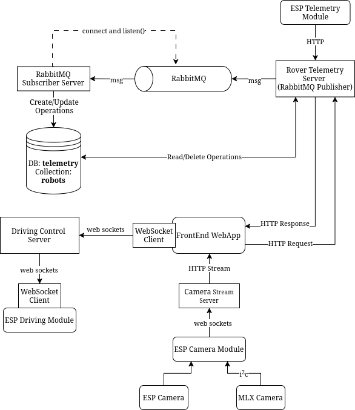

# Remote Controlled Rover Backend System

> A distributed backend system for real-time rover control, telemetry collection , camera streaming and data storage.
> 
> Designed for real-time control using websockets, and high-frequency telemetry using message queues and decouple services.

This system was designed and developed by:
- [Ahmad El-Gohary](https://github.com/ahmadlgohary)
- [Safwan Hossain](https://github.com/safhossain)

## Table of Contents

1. [Overview](#overview)
2. [System Architecture](#system-architecture)
3. [Servers](#servers)
4. [Data Flow](#data-flow)
5. [Tech Stack](#tech-stack)
6. [Usage](#usage)

---

## Overview

This project is a micro-services based backend system built for a remote controlled rover.

It handles:
    - Real-time driving commands
    - High-frequency telemetry collection
    - Reliable database storage
    - Live camera and thermal video streaming

A micro-services architecture was selected to prevent bottlenecks, race conditions, and allow independent development.

---

## System Architecture

  

---

## Servers

### 1. Driving Control Server (WebSockets)
- Routes real-time driving commands between frontend and rover
- Enables low-latency rover control
- [Project](/drive-control-server/)

### 2. Rover Telemetry Server (HTTP + RabbitMQ Publisher)
- Receives telemetry via HTTP POST
- Publishes telemetry to RabbitMQ
- Exposes REST API endpoints for querying telemetry sessions
- [Project](/rover-telemetry-server/)

### 3. RabbitMQ Subscriber Server (RabbitMQ Consumer)
- Consumes telemetry from RabbitMQ
- Sequential database writes
- Stores Telemetry in MongoDB
- Prevents race conditions and database overload. See **Purpose** in the project's [README](/rabbitmq-subscriber-server/README.md#purpose)
- [Project](/rabbitmq-subscriber-server/)

### 4. Camera Stream Server (WebSockets + HTTP Streaming)
- Receives:
    - Normal camera frames from ESP Camera
    - Thermal camera frames from MLX90640
- Converts incoming data into MJPEG streams
- Streams video to frontend over HTTP multipart streams
- [Project](/camera-stream-server/)

---

## Data Flow

### Telemetry Flow
1. Rover sends telemetry over HTTP post to the `Rover Telemetry Server`
2. `Rover Telemetry Server` publishes it to `RabbitMQ`
3. `RabbitMQ Subscriber Server` consumes the messages and stores them to MongoDB

### Drive Control Flow
1. Frontend sends driving commands via WebSockets
2. Drive Control Server routes messages by Client ID
3. Rover receives commands in real-time

### Camera Streaming Flow
1. Rover sends camera data via WebSockets
2. Camera Stream Server generates the frames
3. Frontend consumes MJPEG streams over HTTP

## Tech Stack

- **Backend**: Node.js, Python FastAPI
- **Messaging**: RabbitMQ
- **Database**: MongoDB
- **Networking**: WebSockets, REST APIs
- **Streaming**: HTTP MJPEG
- **Containerization**: Docker, Docker Compose

## Usage

### Prerequisites
- Node.js >= 18
- Python >= 3.10
- RabbitMQ
- MongoDB
- Docker & Docker Compose (optional)

### Running the system
1. Start MongoDB
2. Start RabbitMQ
3. Start RabbitMQ Subscriber Server
4. Start Rover Telemetry Server
5. Start Drive Control Server
6. Start Camera Stream Server

Steps 2-6 can be automated by using Docker Compose

### Running the system using Docker Compose
- Docker & Docker Compose are required
1. Start MongoDB
2. `sudo docker-compose up`

